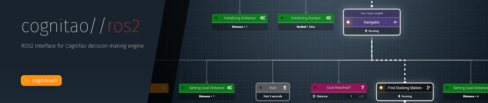

<div align="center">
  <br><br>
</div>

-----------------

# COGNITAO_ROS
Decision making system implementation interface and proxy for ROS.

For more information about CogniTAO decision making system see-[https://github.com/cogniteam/cognitao] 

- [COGNITAO_ROS](#cognitaoros)
  - [Getting atarted](#getting-atarted)
  - [Integration](#integration)
  - [Prerequisites](#prerequisites)
  - [RosDataSource](#rosdatasource)
  - [Contributing](#contributing)
## Getting atarted
First, create your own workspace.
The next step is to download the project into the src directory.
To get a copy of the project up and running on your local machine use Download button.

Clone using :
```
git clone "https://github.com/cogniteam/cognitao_ros.git"
```

Install the CogniTAO library using install.sh script located in[yourWorkspace/src/cognitao_ros].
```
cd yourWorkspace/src/cognitao_ros

//run the install.sh script
./install.sh
```
The install.sh script:
- Downloads the CogniTAO library.
- Compiles the project.

After the script is ran the project will be placed in [yourWorkspace/src/cognitao.git].

## Integration

To use the CogniTAO library in your workspace add to your project file:
```
#include <CogniTAO.h>
```

**CMake**
After writing yout node, dont forget to add to your CMake file the executable file.
```
# CMakeLists.txt
add_executable(dm_ros_node
	  src/main.cpp		
)  
```
## Prerequisites
C++11 support, ROS.

## RosDataSource 
For the worldM<odel ROS interface- use the RosDataSource when initializing the World Model.
```
WM::init(new RosDataSource(argc, argv));
```

The RosDataSource object listens to a topic called "/wme/out".
When someone publishes an event to this topic, the RosDataSource gets the message and sets the key-value parameters.
To publish via terminal:
```
rostopic pub /wme/in dm_ros/EventMsg '{key: COIN, value: ENT}'
```
** Publish COIN event
The setVar() method publishes to a topic called "/wme/in".
The kind of the messages is EventMsg.

EventMsg:
This message has two fields- both sting type.
The first field called- key, the second- value.
```
string key
string value
```


## Contributing

Feel free to contact us at info@cogniteam.com if you wish to contribute code to the library

